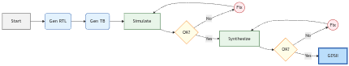
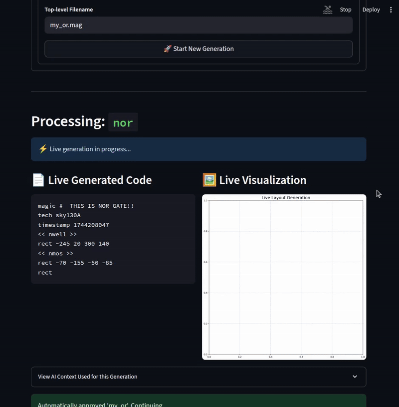
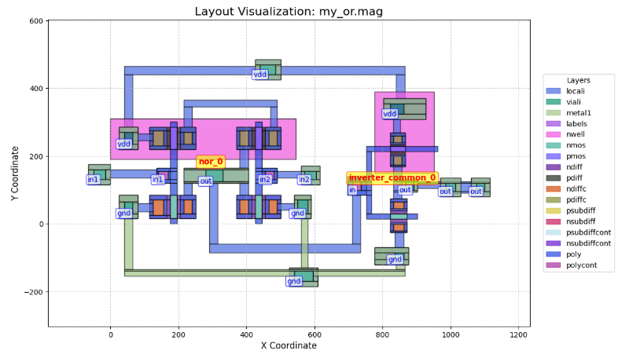
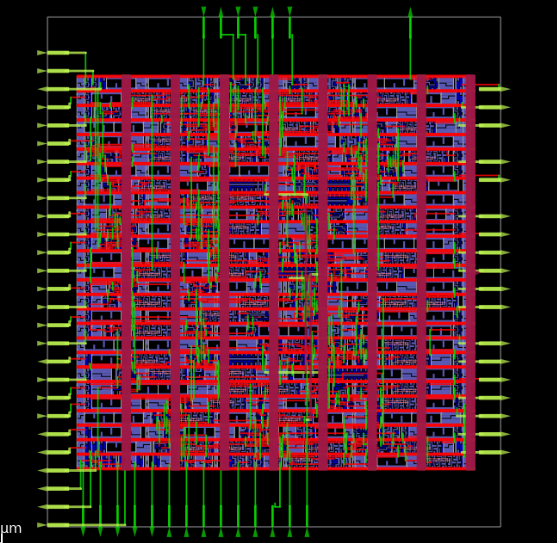

# Chipster: LLM for Chip Design Automation

Chipster is a unified platform that leverages Large Language Models (LLMs) to accelerate the digital chip design process. It integrates two powerful tools:

1.  **Verilog Generator**: An automated RTL-to-GDSII flow that translates high-level functional descriptions into synthesizable Verilog, ready for physical design.
2.  **Standard Cell Generator**: An AI-powered tool to generate `.mag` physical layout files for standard digital logic cells from simple text prompts.

### Verilog Generation Workflow


## Features

-   **Natural Language to RTL**: Describe a digital module, and the LLM generates the Verilog code.
-   **Automated Verification**: Automatically generates testbenches and runs simulations with Icarus Verilog.
-   **Full Synthesis Flow**: Integrates with OpenLane to perform synthesis, placement, and routing.
-   **AI-Powered Layout**: Generates standard cell layouts using a Retrieval-Augmented Generation (RAG) approach.
-   **Interactive UI**: Built with Streamlit for an intuitive and interactive user experience.

## Demos and Results

### Standard Cell Generator

**Demo Video:**
See how the tool generates a standard cell layout from a simple text prompt in real-time.



**Generated Layout Result:**
Below is the final layout for an OR gate (`my_or.mag`) generated by the tool, including its sub-components.



### Verilog Generator

The Verilog Generator takes a design from a simple prompt all the way to a final GDSII layout. Below is the final chip layout for a generated module after being processed by the OpenLane flow.



## Documentation

For detailed instructions on setup, usage, and architecture, please see our full documentation:

-   [**Documentation Home**](./docs/README.md)
-   [**Verilog Generator Guide**](./docs/verilog_generator.md)
-   [**Standard Cell Generator Guide**](./docs/std_cell_generator.md)

## Quickstart

1.  **Clone the repository:**
    ```bash
    git clone https://github.com/adeirman46/Chipster
    cd Chipster
    ```

2.  **Set up the environment:**
    Ensure you have Conda, Docker, Icarus Verilog, and OpenLane installed.
    ```bash
    conda create -n chipster_env python=3.11
    conda activate chipster_env
    pip install -r requirements.txt
    crawl4ai-setup
    crawl4ai-doctor
    ```
    Create .env file and enter your Gemini API.
    ```bash
    GOOGLE_API_KEY="YOUR_API"
    ```

3.  **Run the application:**
    ```bash
    streamlit run app.py
    ```

## Contributors

### Project Mentor
-   **Prof. Mehdi Saligane** (University of Michigan, Brown University)

### Development Team 
(Bandung Institute of Technology)
-   Ade Irman Budi Hendriawan
-   Najmi Azzahra
-   William
-   Rifki Afriadi

---
*This project is licensed under the MIT License.*
