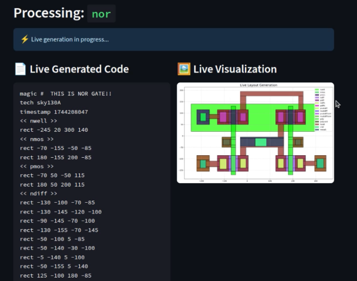

# Standard Cell Generator Guide

The Standard Cell Generator uses a Retrieval-Augmented Generation (RAG) pipeline to create `.mag` layout files for common logic gates. It leverages a vector database of existing cell layouts to produce new, valid designs based on your prompts.

## How It Works

1.  **Prompt**: You provide a simple prompt, like "an inverter gate".
2.  **Retrieval**: The system searches a FAISS vector index of known `.mag` files to find the most relevant examples.
3.  **Generation**: The retrieved examples are passed to the LLM along with your prompt as context. The LLM then generates a new `.mag` file based on the patterns and structures it observed.
4.  **Visualization & Refinement**: The generated layout is displayed in the UI. You can either accept it or provide further instructions to improve it.

## Usage

1.  Select the "Standard Cell Generator" tool from the sidebar.
2.  Enter the name of the cell you wish to create (e.g., `my_inverter`).
3.  Provide a prompt describing the cell.
4.  Click "Generate" to see the AI-generated layout. You can then choose to save, discard, or improve the result.