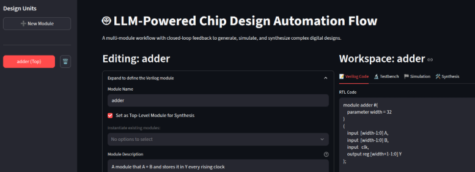

# Verilog Generator Guide

The Verilog Generator tool is an end-to-end solution that takes a natural language description of a digital logic module and processes it through a complete design, verification, and synthesis flow.

## How It Works

The workflow is composed of several automated steps:

1.  **Verilog Generation**: You provide a prompt (e.g., "create a 4-bit adder"). The LLM generates the corresponding Verilog code.
2.  **Testbench Generation**: The LLM creates a testbench to verify the functionality of the generated module.
3.  **Simulation**: The tool uses Icarus Verilog to compile and run the simulation, checking for correctness. If errors occur, the LLM attempts to fix the code.
4.  **Synthesis**: Once verification passes, the design is sent to OpenLane for synthesis, place-and-route, and GDSII file generation.

## Usage

1.  Navigate to the "Verilog Generator" tab from the main application sidebar.
2.  Enter a descriptive name for your design module (e.g., `my_adder`).
3.  In the prompt box, describe the module you want to create.
4.  Click "Generate Verilog" and follow the on-screen instructions as the tool progresses through each stage of the flow.